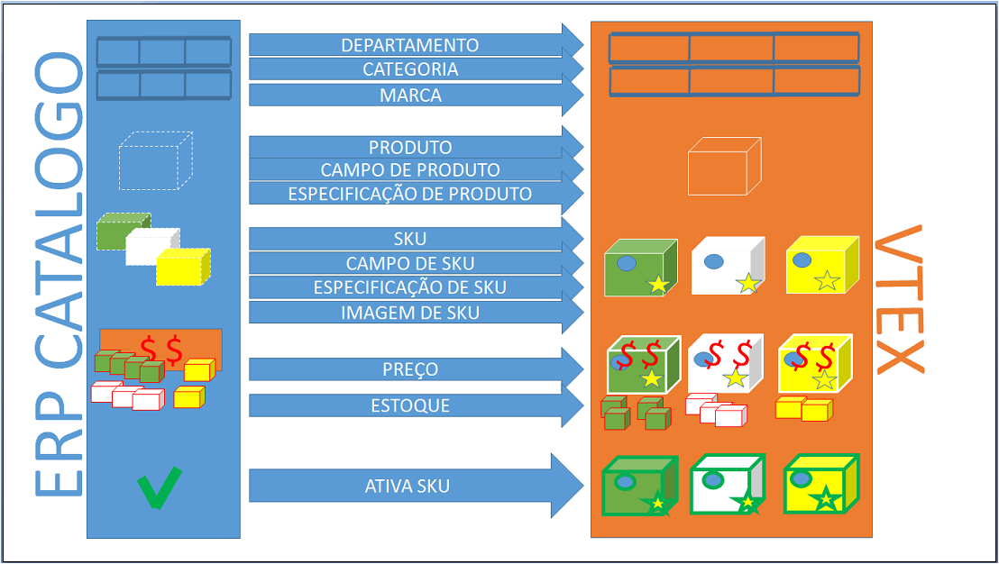

#Integração Completa de Catálogo, Preço e Estoque

Este documento tem por objetivo auxiliar na integração de catálogo (departamento, categoria, marca, imagens, campos, valores de campos, ativação de SKUs), preço e estoque do ERP para a uma loja hospedada na versão smartcheckout da VTEX. Nesse tipo de integração a maioria da adminstração da loja está ERP.

 

###Catalogo Fluxo Completo

{: #1 .slug-text}

Nesse cenário de fluxo completo, a maioria dos dados de produtos e SKUs são manipulados pelo ERP (marca, imagens, categoria, ativação, etc...). A manipulação de campos de especificação nesse modelo é possivel ser feita por API REST, mais a melhor prática seria pelo admin da VTEX.

Para o ERP integrar o catálogo com um da loja na VTEX, deverá usar o webservice da própria loja, que por definição atenderá em [https:webservice-nomedaloja-vtexcommerce.com.br/service.svc?wsdl](https:webservice-nomedaloja-vtexcommerce.com.br/service.svc?wsdl "web service da loja"). As credenciais de acesso ao webservice deverão ser solicitadas junto ao administrador da loja.

Futuramente além do serviço SOAP (webservice) estaremos também oferecendo integração de catálogo por APIs REST (JSON) bem definidas e de alta performance.

##Organização dos Produtos Dentro da Loja

{: #2 .slug-text}

Geralmente, os produtos são organizados dentro da loja em estruturas mercadológicas formadas por:

1. **Departamento** - categoria cujo id de categoria pai é **nulo**, 
2. **Categoria** - categoria cujo id de categoria pai é um **departamento**,
3. **SubCategoria**. categoria cujo id de categoria pai é um **categoria**

*Exemplo:*  
*Departamento/Categoria/SubCategoria/Produto*  
*Ferramentas/Eletricas/Furradeiras/Super Drill*

##Departamento

{: #3 .slug-text}

Abaixo exemplos de chamada e resposta de inseção de Departamentos e as Categorias através do metodo "CategoryInsertUpdate":

_request:_  


	<soapenv:Envelope xmlns:soapenv="http://schemas.xmlsoap.org/soap/envelope/" xmlns:tem="http://tempuri.org/" xmlns:vtex="http://schemas.datacontract.org/2004/07/Vtex.Commerce.WebApps.AdminWcfService.Contracts">
	   <soapenv:Header/>
	   <soapenv:Body>
	      <tem:CategoryInsertUpdate>
	         <tem:category>
	            <vtex:Description>Departamento de Artesanato</vtex:Description>
	            <vtex:IsActive>true</vtex:IsActive>
	            <vtex:Keywords>Departamento Keywords</vtex:Keywords>
	            <vtex:Name>Departamento Artesanato</vtex:Name>
	            <vtex:Title>Departamento Artesanato</vtex:Title>
	         </tem:category>
	      </tem:CategoryInsertUpdate>
	   </soapenv:Body>
	</soapenv:Envelope>


_response:_  

	
	<s:Envelope xmlns:s="http://schemas.xmlsoap.org/soap/envelope/">
	   <s:Body>
	      <CategoryInsertUpdateResponse xmlns="http://tempuri.org/">
	         <CategoryInsertUpdateResult xmlns:a="http://schemas.datacontract.org/2004/07/Vtex.Commerce.WebApps.AdminWcfService.Contracts" xmlns:i="http://www.w3.org/2001/XMLSchema-instance">
	            <a:AdWordsRemarketingCode i:nil="true"/>
	            <a:Description>Departamento de Artesanato</a:Description>
	            <a:FatherCategoryId i:nil="true"/>
	            <a:Id>1000018</a:Id>
	            <a:IsActive>true</a:IsActive>
	            <a:Keywords>Departamento Keywords</a:Keywords>
	            <a:LomadeeCampaignCode i:nil="true"/>
	            <a:Name>Departamento Artesanato</a:Name>
	            <a:Title>Departamento Artesanato</a:Title>
	         </CategoryInsertUpdateResult>
	      </CategoryInsertUpdateResponse>
	   </s:Body>
	</s:Envelope>


##Categoria

_request:_  


	<soapenv:Envelope xmlns:soapenv="http://schemas.xmlsoap.org/soap/envelope/" xmlns:tem="http://tempuri.org/" xmlns:vtex="http://schemas.datacontract.org/2004/07/Vtex.Commerce.WebApps.AdminWcfService.Contracts">
	   <soapenv:Header/>
	   <soapenv:Body>
	      <tem:CategoryInsertUpdate>
	         <tem:category>
	            <vtex:Description>Artesanato de Barro</vtex:Description>
	            <vtex:FatherCategoryId>1000018</vtex:FatherCategoryId>
	            <vtex:IsActive>true</vtex:IsActive>
	            <vtex:Keywords>Barro</vtex:Keywords>
	            <vtex:Name>Artesanato de Barro</vtex:Name>
	            <vtex:Title>Artesanato de Barro</vtex:Title>
	         </tem:category>
	      </tem:CategoryInsertUpdate>
	   </soapenv:Body>
	</soapenv:Envelope>


_response_:  


	<s:Envelope xmlns:s="http://schemas.xmlsoap.org/soap/envelope/">
	   <s:Body>
	      <CategoryInsertUpdateResponse xmlns="http://tempuri.org/">
	         <CategoryInsertUpdateResult xmlns:a="http://schemas.datacontract.org/2004/07/Vtex.Commerce.WebApps.AdminWcfService.Contracts" xmlns:i="http://www.w3.org/2001/XMLSchema-instance">
	            <a:AdWordsRemarketingCode i:nil="true"/>
	            <a:Description>Artesanato de Barro</a:Description>
	            <a:FatherCategoryId>1000018</a:FatherCategoryId>
	            <a:Id>1000019</a:Id>
	            <a:IsActive>true</a:IsActive>
	            <a:Keywords>Barro</a:Keywords>
	            <a:LomadeeCampaignCode i:nil="true"/>
	            <a:Name>Artesanato de Barro</a:Name>
	            <a:Title>Artesanato de Barro</a:Title>
	         </CategoryInsertUpdateResult>
	      </CategoryInsertUpdateResponse>
	   </s:Body>
	</s:Envelope>


##Sub Categoria

_request:_  


	<soapenv:Envelope xmlns:soapenv="http://schemas.xmlsoap.org/soap/envelope/" xmlns:tem="http://tempuri.org/" xmlns:vtex="http://schemas.datacontract.org/2004/07/Vtex.Commerce.WebApps.AdminWcfService.Contracts">
	   <soapenv:Header/>
	   <soapenv:Body>
	      <tem:CategoryInsertUpdate>
	         <tem:category>
	            <vtex:Description>Barro Vermelho</vtex:Description>
	            <vtex:FatherCategoryId>1000019</vtex:FatherCategoryId>
	            <vtex:IsActive>true</vtex:IsActive>
	            <vtex:Keywords>Barro Vermelho</vtex:Keywords>
	            <vtex:Name>Artesanato de Barro Vermelho</vtex:Name>
	            <vtex:Title>Artesanato de Barro Vermelho</vtex:Title>
	         </tem:category>
	      </tem:CategoryInsertUpdate>
	   </soapenv:Body>
	</soapenv:Envelope>


_response:_  


	<s:Envelope xmlns:s="http://schemas.xmlsoap.org/soap/envelope/">
	   <s:Body>
	      <CategoryInsertUpdateResponse xmlns="http://tempuri.org/">
	         <CategoryInsertUpdateResult xmlns:a="http://schemas.datacontract.org/2004/07/Vtex.Commerce.WebApps.AdminWcfService.Contracts" xmlns:i="http://www.w3.org/2001/XMLSchema-instance">
	            <a:AdWordsRemarketingCode i:nil="true"/>
	            <a:Description>Barro Vermelho</a:Description>
	            <a:FatherCategoryId>1000019</a:FatherCategoryId>
	            <a:Id>1000020</a:Id>
	            <a:IsActive>true</a:IsActive>
	            <a:Keywords>Barro Vermelho</a:Keywords>
	            <a:LomadeeCampaignCode i:nil="true"/>
	            <a:Name>Artesanato de Barro Vermelho</a:Name>
	            <a:Title>Artesanato de Barro Vermelho</a:Title>
	         </CategoryInsertUpdateResult>
	      </CategoryInsertUpdateResponse>
	   </s:Body>
	</s:Envelope>


##Marca

{: #5 .slug-text}

Abaixo exemplo de chamada e resposta de inseção de Marca através do metodo "BrandInsertUpdate":

_request:_  


	<soapenv:Envelope xmlns:soapenv="http://schemas.xmlsoap.org/soap/envelope/" xmlns:tem="http://tempuri.org/" xmlns:vtex="http://schemas.datacontract.org/2004/07/Vtex.Commerce.WebApps.AdminWcfService.Contracts">
	   <soapenv:Header/>
	   <soapenv:Body>
	      <tem:BrandInsertUpdate>
	         <tem:brand>
	            <vtex:Description>Marca DuBom</vtex:Description>
	            <vtex:IsActive>true</vtex:IsActive>
	            <vtex:Keywords>DuBom Keywords</vtex:Keywords>
	            <vtex:Name>DuBom</vtex:Name>
	            <vtex:Title>DuBom</vtex:Title>
	         </tem:brand>
	      </tem:BrandInsertUpdate>
	   </soapenv:Body>
	</soapenv:Envelope>


_response:_  


	<s:Envelope xmlns:s="http://schemas.xmlsoap.org/soap/envelope/">
	   <s:Body>
	      <BrandInsertUpdateResponse xmlns="http://tempuri.org/">
	         <BrandInsertUpdateResult xmlns:a="http://schemas.datacontract.org/2004/07/Vtex.Commerce.WebApps.AdminWcfService.Contracts" xmlns:i="http://www.w3.org/2001/XMLSchema-instance">
	            <a:AdWordsRemarketingCode i:nil="true"/>
	            <a:Description>Marca DuBom</a:Description>
	            <a:Id>2000011</a:Id>
	            <a:IsActive>true</a:IsActive>
	            <a:Keywords>DuBom Keywords</a:Keywords>
	            <a:LomadeeCampaignCode i:nil="true"/>
	            <a:Name>DuBom</a:Name>
	            <a:Title>DuBom</a:Title>
	         </BrandInsertUpdateResult>
	      </BrandInsertUpdateResponse>
	   </s:Body>
	</s:Envelope


## Produtos e SKUs

{: #6 .slug-text}

[[Developer] - Ver guia de integração de catalogo expresso](http://lab.vtex.com/docs/integracao/guide/erp/catalogo-expresso/index.html)

###Fields de Produto ou SKU

{: #6 .slug-text}

Os fields genéricos dos produtos devem ser adicionado a categoria direta do produto e indicados com IsStockKeepingUnit = false, e os fields específicos de SKUs devem ser inseridos na Categoria direta da SKU e indicados com IsStockKeepingUnit = true. Não temos metodos no webservice para inserir Fields (campos), uma API REST beta deve ser usada para isso.

<a title="inserir um campo de especificação" href="http://bridge.vtexlab.com.br/vtex.bridge.web_deploy/swagger/ui/index.html#!//CATALOG/CATALOG_Sugestion_0" target="_blank">[Developer beta] - Exemplo de chamada para inserir inserir um campo de especificação de produto ou SKU</a>

####Valores dos Fields

Adicionado o campo, colocar valores nos campos.

TODO

###Imagens das SKUs

{: #7 .slug-text}

Exemplo de request para inserir Imagens para uma SKU no webservice. Lembrando que os metodo de remover imagens estão depreciados, por isso ao inserir as imagens, procure inserir as imagens o mais perto da imagem real possível.

_request:_  

	<soapenv:Envelope xmlns:soapenv="http://schemas.xmlsoap.org/soap/envelope/" xmlns:tem="http://tempuri.org/">
	   <soapenv:Header/>
	   <soapenv:Body>
	      <tem:ImageServiceInsertUpdate>
			<!--url da imagem-->
	        <tem:urlImage>https://encrypted-tbn3.gstatic.com/images?q=tbn:ANd9GcQ6Lu0obmddsQX3JELe04hUs_hSelsmU8_W1yn5ztgdAk5SJC7D</tem:urlImage>
			<!--nome da imagem-->
	        <tem:imageName>Barro Vermelho Escuro</tem:imageName>
			<!--identificador do SKu que irá receber a imagem-->
	         <tem:stockKeepingUnitId>31018371</tem:stockKeepingUnitId>
	      </tem:ImageServiceInsertUpdate>
	   </soapenv:Body>
	</soapenv:Envelope>


_response:_  


	<s:Envelope xmlns:s="http://schemas.xmlsoap.org/soap/envelope/">
	   <s:Body>
	      <ImageServiceInsertUpdateResponse xmlns="http://tempuri.org/"/>
	   </s:Body>
	</s:Envelope>


_request 2:_  


	<soapenv:Envelope xmlns:soapenv="http://schemas.xmlsoap.org/soap/envelope/" xmlns:tem="http://tempuri.org/">
	   <soapenv:Header/>
	   <soapenv:Body>
	      <tem:ImageServiceInsertUpdate>
	         <tem:urlImage>http://1.bp.blogspot.com/_ZANjG3oA2BI/TCJfvX-7daI/AAAAAAAADZ0/yO5MwjMtjdI/s400/vaso_5cm.jpg</tem:urlImage>
	         <tem:imageName>Barro Vermelho Claro</tem:imageName>
	         <tem:stockKeepingUnitId>31018372</tem:stockKeepingUnitId>
	          <tem:fileId>31018372</tem:fileId>
	      </tem:ImageServiceInsertUpdate>
	   </soapenv:Body>
	</soapenv:Envelope>


_response 2:_  

  
	<s:Envelope xmlns:s="http://schemas.xmlsoap.org/soap/envelope/">
	   <s:Body>
	      <ImageServiceInsertUpdateResponse xmlns="http://tempuri.org/"/>
	   </s:Body>
	</s:Envelope>


##Preço e Estoque

{: #8 .slug-text}

Uma vez cadastradas os produtos e as SKUs na loja da VTEX, é necessário alimentar o estoque e acertar o preço na tabela de preço (se no momento de inserir a SKU não enviou o preço).

###Preço

Se no momento sa inserção da SKU não foi enviado um preço válido para a SKU é necessário inserir o preço da mesma. Isso pode ser feito direto no admin da loja na VTEX (_urldaloja/admin/Site/SkuTabelaValor.aspx_), ou usando a API REST do sistema de **Pricing**.

Através da API do Pricing, inserir ou atualizar preço na SKUs:

<a title="inserir ou atualizar preço na SKUs" href="http://bridge.vtexlab.com.br/vtex.bridge.web_deploy/swagger/ui/index.html#!/PRICING/PRICING_Set" target="_blank">[Developer] - Exemplo de chamada para inserir ou atualizar preço nas SKUs</a>

A documentação completa sobre a API de **Pricing** se encontra em: [http://lab.vtex.com/docs/pricing/api/latest/pricing/index.html](http://lab.vtex.com/docs/pricing/api/latest/pricing/index.html)

###Estoque

Através da API do Logistics, inserir ou atualizar os estoques na SKUs:

<a title="inserir ou atualizar os estoques na SKUs" href="http://bridge.vtexlab.com.br/vtex.bridge.web_deploy/swagger/ui/index.html#!/LOGISTICS/LOGISTICS_SetBalance" target="_blank">[Developer] - Exemplo de chamada para inserir ou atualizar estoque nas SKUs</a>

A documentação completa sobre a API de **Logistics** se encontra em: [http://lab.vtex.com/docs/logistics/api/latest/warehouse/index.html](http://lab.vtex.com/docs/logistics/api/latest/warehouse/index.html)

###Ativa SKUs

{: #9 .slug-text}

Após as SKUs estarem inseridas debaixo de seus produtos agrupadores ou não, e com todos os pre requistos de ativação preenchidos (imagem, estoque, preço, especificações, se tiver) basta ativá-las. Exempos de chamadas de ativação de SKU.

_request:_  


	<soapenv:Envelope xmlns:soapenv="http://schemas.xmlsoap.org/soap/envelope/" xmlns:tem="http://tempuri.org/">
	   <soapenv:Header/>
	   <soapenv:Body>
	      <tem:StockKeepingUnitActive>
			<!--identificador da SKU que deseja tentar ativar-->
	         <tem:idStockKeepingUnit>31018371</tem:idStockKeepingUnit>
	      </tem:StockKeepingUnitActive>
	   </soapenv:Body>
	</soapenv:Envelope>


_response:_  


	<s:Envelope xmlns:s="http://schemas.xmlsoap.org/soap/envelope/">
	   <s:Body>
	      <StockKeepingUnitActiveResponse xmlns="http://tempuri.org/"/>
	   </s:Body>
	</s:Envelope>


_request 2:_  


	<soapenv:Envelope xmlns:soapenv="http://schemas.xmlsoap.org/soap/envelope/" xmlns:tem="http://tempuri.org/">
	   <soapenv:Header/>
	   <soapenv:Body>
	      <tem:StockKeepingUnitActive>
	         <tem:idStockKeepingUnit>31018372</tem:idStockKeepingUnit>
	      </tem:StockKeepingUnitActive>
	   </soapenv:Body>
	</soapenv:Envelope>


_response 2:_  


	<s:Envelope xmlns:s="http://schemas.xmlsoap.org/soap/envelope/">
	   <s:Body>
	      <StockKeepingUnitActiveResponse xmlns="http://tempuri.org/"/>
	   </s:Body>
	</s:Envelope>


###Alteração de SKUs

{: #10 .slug-text}

Após uma SKU ser inserida com sucesso, caso haja alguma necessidade de alguma alteração, deve se invocar o mesmo método de inserçao passando o id de SKU que se deseja alterar. Alterações de preço **NÃO** devem ser feitas pelo metodo de insert/update de SKU. 

As alterações de preço devem ser feitas diretamente na API REST de **Pricing**:  
<a title="inserir ou atualizar preço na SKUs" href="http://bridge.vtexlab.com.br/vtex.bridge.web_deploy/swagger/ui/index.html#!/PRICING/PRICING_Set" target="_blank">[Developer] - Exemplo de chamada para inserir ou atualizar preço nas SKUs</a>

_request:_  


	<soapenv:Envelope xmlns:soapenv="http://schemas.xmlsoap.org/soap/envelope/" xmlns:tem="http://tempuri.org/" xmlns:vtex="http://schemas.datacontract.org/2004/07/Vtex.Commerce.WebApps.AdminWcfService.Contracts">
	   <soapenv:Header/>
	   <soapenv:Body>
	      <tem:StockKeepingUnitInsertUpdate>
	         <tem:stockKeepingUnitVO>
				<!--number, cubagem = peso cubico -->
	            <vtex:CubicWeight>100</vtex:CubicWeight>
				<!--number, altura com embalagem e metros-->
	            <vtex:Height>1.800</vtex:Height>
				<!--bool, se não atender requisitos de ativação(imagem, preço, estoque, espec., outros reqs obrig.), não será ativado-->
	            <vtex:IsActive>true</vtex:IsActive>
				<!--bool, disponibilidade -->
	            <vtex:IsAvaiable>true</vtex:IsAvaiable>
				<!--bool, é um KIT? -->
	            <vtex:IsKit>false</vtex:IsKit>
				<!--number, comprimento com embalagem em metros -->
	            <vtex:Length>1.52</vtex:Length>
				<!--decimal, ** ler obs --> 
				<vtex:ListPrice>150.0</vtex:ListPrice>
				<!--prefixo do estoque (id estoque = 1_1, mandar 1) -->
	            <vtex:ModalId>1</vtex:ModalId>
				<!--string, opicional, tipo de carga, necessita configuração de transportadora especial quando preenchido -->
	            <vtex:ModalType>Vidro</vtex:ModalType>
				<!--string, nome da SKU -->
	            <vtex:Name>Vaso Artesanal de Barro Laranja Escuro </vtex:Name>
				<!--decimal,  preço, "POR", opcional **ler obs-->
				<vtex:Price>110.0</vtex:Price>
				<!--number, identificador do produto pai da SKU -->
	            <vtex:ProductId>31018369</vtex:ProductId>
				<!--number, peso real em kilos -->
	            <vtex:RealHeight>1.740</vtex:RealHeight>
				<!--number, altural real em metros -->
	            <vtex:RealLength>1.60</vtex:RealLength>
				<!--number, peso real em kilos -->
	            <vtex:RealWeightKg>2.750</vtex:RealWeightKg>
				<!--number, comprimento real em metros -->
	            <vtex:RealWidth>1.7</vtex:RealWidth>
				<!--number, identificador da SKU no ERP -->
	            <vtex:RefId>00123456</vtex:RefId>
				<!--number, opcional, numero de pontos dessa SKU -->
	            <vtex:RewardValue>0</vtex:RewardValue>
				<!--lista de string, EANs do produto -->
	            <vtex:StockKeepingUnitEans>
	               <vtex:StockKeepingUnitEanDTO>
	                  <vtex:Ean>0123456789123</vtex:Ean>
	               </vtex:StockKeepingUnitEanDTO>
	            </vtex:StockKeepingUnitEans>
				<!--number, unidade de multipliçao para venda -->
	            <vtex:UnitMultiplier>1</vtex:UnitMultiplier>
				<!--number, peso em kilos-->
	            <vtex:WeightKg>1.5</vtex:WeightKg>
				<!--number, largura com embalagem em metros -->
	            <vtex:Width>2.780</vtex:Width>
	         </tem:stockKeepingUnitVO>
	      </tem:StockKeepingUnitInsertUpdate>
	   </soapenv:Body>
	</soapenv:Envelope>


*Os campos Id ou RefId definem se será um insert ou um update, caso o id de SKU enviado ou o RefId enviado já existirem, será um update.

**Caso passe preço nulo no update, o preço não será afetado.

_response:_  


	<s:Envelope xmlns:s="http://schemas.xmlsoap.org/soap/envelope/">
	   <s:Body>
	      <StockKeepingUnitInsertUpdateResponse xmlns="http://tempuri.org/">
	         <StockKeepingUnitInsertUpdateResult xmlns:a="http://schemas.datacontract.org/2004/07/Vtex.Commerce.WebApps.AdminWcfService.Contracts" xmlns:i="http://www.w3.org/2001/XMLSchema-instance">
	            <a:CommercialConditionId i:nil="true"/>
	            <a:CostPrice>1</a:CostPrice>
	            <a:CubicWeight>100</a:CubicWeight>
	            <a:DateUpdated>2014-10-29T19:03:17.718427</a:DateUpdated>
	            <a:EstimatedDateArrival i:nil="true"/>
	            <a:Height>1.800</a:Height>
	            <a:Id>31018371</a:Id>
	            <a:InternalNote i:nil="true"/>
	            <a:IsActive>false</a:IsActive>
	            <a:IsAvaiable>false</a:IsAvaiable>
	            <a:IsKit>false</a:IsKit>
	            <a:Length>1.52</a:Length>
	            <a:ListPrice>150.0</a:ListPrice>
	            <a:ManufacturerCode i:nil="true"/>
	            <a:MeasurementUnit>un</a:MeasurementUnit>
	            <a:ModalId>1</a:ModalId>
	            <a:ModalType>Vidro</a:ModalType>
	            <a:Name>Vaso Artesanal de Barro Laranja Escuro</a:Name>
	            <a:Price>110.0</a:Price>
	            <a:ProductId>31018369</a:ProductId>
	            <a:ProductName>Vaso Artesanal de Barro Vermelho</a:ProductName>
	            <a:RealHeight>1.740</a:RealHeight>
	            <a:RealLength>1.60</a:RealLength>
	            <a:RealWeightKg>2.750</a:RealWeightKg>
	            <a:RealWidth>17</a:RealWidth>
	            <a:RefId>00123456</a:RefId>
	            <a:RewardValue>0</a:RewardValue>
	            <a:StockKeepingUnitEans>
	               <a:StockKeepingUnitEanDTO>
	                  <a:Ean>0123456789123</a:Ean>
	               </a:StockKeepingUnitEanDTO>
	            </a:StockKeepingUnitEans>
	            <a:UnitMultiplier>1</a:UnitMultiplier>
	            <a:WeightKg>2.780</a:WeightKg>
	            <a:Width>1.550</a:Width>
	         </StockKeepingUnitInsertUpdateResult>
	      </StockKeepingUnitInsertUpdateResponse>
	   </s:Body>
	</s:Envelope>


####Pedidos e Tracking

{: #11 .slug-text}

Para a integração de pedidos consulte o tópico [Integração de Pedido, Nota Fiscal e Tracking](http://lab.vtex.com/docs/integracao/guide/erp/pedido-e-tracking/index.html).

##

autor: _Jonas Bolognim_
propriedade: _VTEX_