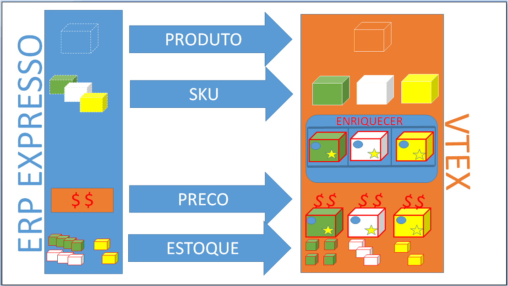

# Integração Rápida de Catálogo e Preço e Estoque

Este documento tem por objetivo auxiliar na integração de catálogo,preço e estoque do ERP para a uma loja hospedada na versão smartcheckout da VTEX, de uma maneira rápida.

Nesse tipo de integração a adminstração da loja está no admin da VTEX, sendo o ERP apenas uma fonte de onde nascem os produstos e SKUs.

### Catalogo Fluxo Básico (Express)
{: #1 .slug-text}

Nesse cenário de fluxo básico, apenas os dados básicos de produtos e SKUs são manipulados pelo ERP, e todo o enriquecimento (marca, fornecedor, imagens, categoria, ativação, etc.) será feito pelo admin da loja na plataforma VTEX.

Para o ERP integrar se ao catálogo da loja na VTEX, deverá usar o webservice da própria loja, que por definição atenderá em [https:webservice-nomedaloja-vtexcommerce.com.br/service.svc?wsdl](https:webservice-sandboxintegracao-vtexcommerce.com.br/service.svc?wsdl "web service da loja"). As credenciais de acesso ao webservice deverão ser solicitadas junto ao administrador da loja.

Futuramente além do serviço SOAP (webservice) estaremos também oferecendo integração de catálogo por APIs REST (JSON) bem definidas e de alta performance.

## Organização dos Produtos Dentro da Loja
{: #2 .slug-text}

Geralmente, os produtos são organizados dentro da loja em estruturas mercadológicas formadas por:

1. **Departamento** - categoria cujo id de categoria pai é **nulo**,
2. **Categoria** - categoria cujo id de categoria pai é um **departamento**,
3. **SubCategoria**. categoria cujo id de categoria pai é um **categoria**

_Exemplo:_  

* Departamento/Categoria/SubCategoria/Produto
* Ferramentas/Eletricas/Furradeiras/Super Drill

O cadastro da estrutura mercadologica deve ser feito diretamente no admin da própria loja (_http://sualoja.com.br/admin/Site/Categories.aspx_), e para atender a integração vinda do ERP, é criado um departamento padrão para produtos que vem do ERP, ou seja, todos os produtos caem no admin da loja nesse departamento padrão, e depois no momento do enriquecimento é colocado na categoria desejada.

## Produtos e SKUs
{: #3 .slug-text}

> Qual é a diferença entre produto e SKU?

  O **Produto** é uma definição mais genérica de algo que é ofertado ao cliente, por exemplo, *Geladeria*, *Camiseta*, *Bola*.

  O **SKU** é uma sigla em ingles de "Stock Keeping Unit", em português Unidade de Manutenção de Estoque, ou seja, uma SKU define uma variação de um produto, por exemplo, *Geladeira Branca 110V*, *Camiseta Amarela Grande*

  No modelo de cadastro de Produtos e SKUs da VTEX, um SKU sempre será filha de um Produto (não existe SKU sem produto), mesmo que esse produto não tenha variçãoes, e nesse caso será 1 SKU para 1 produto, por exemplo, produto *Bola Jabulani* com a *SKU Bola Jabulani*.

## Integração de Produtos e SKUs
{: #4 .slug-text}

Após definida as variações e a estrutura mecadológica da loja, o próximo passo é enviar os produtos e as SKUs do ERP para a loja VTEX.

## Produto
{: #5 .slug-text}

### Parâmetros

| Nome                    | Tipo                          |
| -----------------------:| :-----------------------------|
| **BrandId**           | **Number**   ID da marca. |
| **CategoryId**        | **Number**   ID da categoria. |
| **DepartmentId**      | **Number**   ID do departamento. |
| **Description**       | **String**   Descrição. |
| **DescriptionShort**  | **String**   Resumo. |
| **IsActive**  				| **Bool**   Ativo. |
| **IsVisible**  				| **Bool**   Visivel. |
| **KeyWords**  				| **String**   Palavras chaves. |
| **ListStoreId**  			| **Number**   . |
| **MetaTagDescription** | **String**   . |
| **Name** | **String**   Nome do produto. |
| **RefId** | **String**   refId. |
| **Title** | **String**   Titulo do produto. |
{: .doc-api-table }

_Exemplo:_  

#### Request


	<soapenv:Envelope xmlns:soapenv="http://schemas.xmlsoap.org/soap/envelope/" xmlns:tem="http://tempuri.org/" xmlns:vtex="http://schemas.datacontract.org/2004/07/Vtex.Commerce.WebApps.AdminWcfService.Contracts" xmlns:arr="http://schemas.microsoft.com/2003/10/Serialization/Arrays">
	   <soapenv:Header/>
	   <soapenv:Body>
	      <tem:ProductInsertUpdate>
	         <tem:productVO>
	            <vtex:BrandId>2000011</vtex:BrandId> <!--number, identificdor da marca-->
	            <vtex:CategoryId>1000020</vtex:CategoryId> <!--number, identificdor da categoria-->
	            <vtex:DepartmentId>1000018</vtex:DepartmentId> <!--number, identificdor do departamento-->
	            <vtex:Description>Vaso de barro vermelho, feito a mão com barro do mar vermelho</vtex:Description> <!--string, descrição-->
	            <vtex:DescriptionShort>Vaso de barro vermelho artesanal</vtex:DescriptionShort> <!--string, descrição curta-->
	            <vtex:IsActive>true</vtex:IsActive> <!--bool, true-->
	            <vtex:IsVisible>true</vtex:IsVisible> <!--bool, vai ser visível no site--> 
	            <vtex:KeyWords> Barro, vaso, vermelho</vtex:KeyWords> <!--string, palavras chaves relevantes para a busca-->
	            <vtex:LinkId>vaso_barro_vermelho</vtex:LinkId> <!--string, link do produto na loja, sem espacço e sem caracteres especiais-->
	            <vtex:ListStoreId> <!--lista de inteiros, pra qual canal de vendas = loja principal = 1-->
	               	<arr:int>1</arr:int>
		       		<arr:int>2</arr:int>
	            </vtex:ListStoreId>
	            <vtex:MetaTagDescription>feito a mão com barro do mar vermelho</vtex:MetaTagDescription><!--meta tag de description (SEO)-->
	            <vtex:Name>Vaso Artesanal de Barro Vermelho</vtex:Name> <!--string, nome do produto-->
	             <vtex:RefId>1234567890</vtex:RefId> <!--identificador do produto no ERP-->
	            <vtex:Title>Vaso Artesanal de Barro Vermelho</vtex:Title> <!--tituo do produto-->
	         </tem:productVO>
	      </tem:ProductInsertUpdate>
	   </soapenv:Body>
	</soapenv:Envelope>


#### Response


	<s:Envelope xmlns:s="http://schemas.xmlsoap.org/soap/envelope/">
	   <s:Body>
	      <ProductInsertUpdateResponse xmlns="http://tempuri.org/">
	         <ProductInsertUpdateResult xmlns:a="http://schemas.datacontract.org/2004/07/Vtex.Commerce.WebApps.AdminWcfService.Contracts" xmlns:i="http://www.w3.org/2001/XMLSchema-instance">
	            <a:AdWordsRemarketingCode i:nil="true"/>
	            <a:BrandId>2000011</a:BrandId>
	            <a:CategoryId>1000020</a:CategoryId>
	            <a:DepartmentId>1000018</a:DepartmentId>
	            <a:Description>Vaso de barro vermelho, feito a mão com barro do mar vermelho</a:Description>
	            <a:DescriptionShort>Vaso de barro vermelho artesanal</a:DescriptionShort>
	            <a:Id>31018369</a:Id>
	            <a:IsActive>false</a:IsActive>
	            <a:IsVisible>true</a:IsVisible>
	            <a:KeyWords>Barro, vaso, vermelho</a:KeyWords>
	            <a:LinkId>vaso_barro_vermelho</a:LinkId>
	            <a:ListStoreId xmlns:b="http://schemas.microsoft.com/2003/10/Serialization/Arrays">
	               <b:int>1</b:int>
	               <b:int>2</b:int>
	            </a:ListStoreId>
	            <a:LomadeeCampaignCode i:nil="true"/>
	            <a:MetaTagDescription>feito a mão com barro do mar vermelho</a:MetaTagDescription>
	            <a:Name>Vaso Artesanal de Barro Vermelho</a:Name>
	            <a:RefId>1234567890</a:RefId>
	            <a:ReleaseDate i:nil="true"/>
	            <a:ShowWithoutStock>true</a:ShowWithoutStock>
	            <a:SupplierId i:nil="true"/>
	            <a:TaxCode i:nil="true"/>
	            <a:Title>Vaso Artesanal de Barro Vermelho</a:Title>
	         </ProductInsertUpdateResult>
	      </ProductInsertUpdateResponse>
	   </s:Body>
	</s:Envelope>


### SKU
{: #6 .slug-text}

Uma vez inseridos todos os produtos, que teoricamente são os pais das SKUs, chegou o momento de enviar as SKUs.

### Parâmetros

| Nome                    | Tipo                          |
| -----------------------:| :-----------------------------|
| **CubicWeight**         | **Number**   . |
| **Height**        			| **Number**   Altura. |
| **IsActive**  					| **Bool**   Ativo. |
| **IsAvaiable**  				| **Bool**   Disponível. |
| **IsKit**  							| **Bool**   Define que a SKU será um KIT - **irreversível**. |
| **Length**  						| **Number**   . |
| **ListPrice** 					| **Number**   Define o preço DE do KIT. |
| **ModalId** 						| **Number**   Define o preço DE do KIT. |
| **Name** 								| **String**   Nome do SKU do KIT. |
| **Price** 							| **Number**   Preço. |
| **ProductId** 					| **Number**   ID do produto. |
| **RealHeight** 					| **Number**   Altura. |
| **RealLength** 					| **Number**   Comprimento. |
| **RealWeightKg** 				| **Number**   Peso. |
| **RealWidth** 					| **Number**   Largura. |
| **RefId** 							| **Number**   refId. |
| **RewardValue** 				| **Number**   . |
| **UnitMultiplier** 			| **Number**   . |
| **WeightKg** 						| **Number**   . |
| **Width** 							| **Number**   . |
{: .doc-api-table }

_Exemplo:_  

#### Request


	<soapenv:Envelope xmlns:soapenv="http://schemas.xmlsoap.org/soap/envelope/" xmlns:tem="http://tempuri.org/" xmlns:vtex="http://schemas.datacontract.org/2004/07/Vtex.Commerce.WebApps.AdminWcfService.Contracts">
	   <soapenv:Header/>
	   <soapenv:Body>
	      <tem:StockKeepingUnitInsertUpdate>
	         <tem:stockKeepingUnitVO>
	            <vtex:CubicWeight>100</vtex:CubicWeight> <!--number, cubagem -->
	            <vtex:Height>15</vtex:Height> <!--number, altura com embalagem-->
	            <vtex:IsActive>true</vtex:IsActive> <!--bool, true -->
	            <vtex:IsAvaiable>true</vtex:IsAvaiable> <!--bool, disponível -->
	            <vtex:IsKit>false</vtex:IsKit> <!--bool, é um KIT -->
	            <vtex:Length>15</vtex:Length> <!--number, comprimento com embalagem -->
				<vtex:ListPrice>150.0</vtex:ListPrice> <!--decimal, ** ler obs --> 
	            <vtex:ModalId>1</vtex:ModalId> <!--prefixo do estoque (id estoque = 1_1, mandar 1) -->
	            <vtex:ModalType>Vidro</vtex:ModalType> <!--string, tipo de carga, se precisa de transportadora especial -->
	            <vtex:Name>Vaso Artesanal de Barro Vermelho Escuro </vtex:Name> <!--string, nome da SKU -->
   				<vtex:Price>110.0</vtex:Price> <!--decimal, **ler obs-->
	            <vtex:ProductId>31018369</vtex:ProductId> <!--number, identificador do produto pai da SKU -->
	            <vtex:RealHeight>17</vtex:RealHeight> <!--number, peso real -->
	            <vtex:RealLength>17</vtex:RealLength> <!--number, altural real -->
	            <vtex:RealWeightKg>10</vtex:RealWeightKg> <!--number, peso real -->
	            <vtex:RealWidth>17</vtex:RealWidth> <!--number, comprimento real -->
	            <vtex:RefId>00123456</vtex:RefId> <!--number, identificador da SKU no ERP -->
	            <vtex:RewardValue>0</vtex:RewardValue> <!--number, numero de pontos dessa SKU -->
	            <vtex:StockKeepingUnitEans> <!--lista de string, EANs do produto -->
	               <vtex:StockKeepingUnitEanDTO>
	                  <vtex:Ean>0123456789123</vtex:Ean>
	               </vtex:StockKeepingUnitEanDTO>
	            </vtex:StockKeepingUnitEans>
	            <vtex:UnitMultiplier>1</vtex:UnitMultiplier> <!--number, unidade de de venda -->
	            <vtex:WeightKg>9</vtex:WeightKg> <!--number, peso em kilos-->
	            <vtex:Width>15</vtex:Width> <!--number, largura com embalagem -->
	         </tem:stockKeepingUnitVO> <!-- -->
	      </tem:StockKeepingUnitInsertUpdate>
	   </soapenv:Body>
	</soapenv:Envelope>


#### Response


	<s:Envelope xmlns:s="http://schemas.xmlsoap.org/soap/envelope/">
	   <s:Body>
	      <StockKeepingUnitInsertUpdateResponse xmlns="http://tempuri.org/">
	         <StockKeepingUnitInsertUpdateResult xmlns:a="http://schemas.datacontract.org/2004/07/Vtex.Commerce.WebApps.AdminWcfService.Contracts" xmlns:i="http://www.w3.org/2001/XMLSchema-instance">
	            <a:CommercialConditionId i:nil="true"/>
	            <a:CostPrice>1</a:CostPrice>
	            <a:CubicWeight>100</a:CubicWeight>
	            <a:DateUpdated>2014-10-29T19:03:17.718427</a:DateUpdated>
	            <a:EstimatedDateArrival i:nil="true"/>
	            <a:Height>15</a:Height>
	            <a:Id>31018371</a:Id>
	            <a:InternalNote i:nil="true"/>
	            <a:IsActive>false</a:IsActive>
	            <a:IsAvaiable>false</a:IsAvaiable>
	            <a:IsKit>false</a:IsKit>
	            <a:Length>15</a:Length>
	            <a:ListPrice>150.0</a:ListPrice>
	            <a:ManufacturerCode i:nil="true"/>
	            <a:MeasurementUnit>un</a:MeasurementUnit>
	            <a:ModalId>1</a:ModalId>
	            <a:ModalType>Vidro</a:ModalType>
	            <a:Name>Vaso Artesanal de Barro Vermelho Escuro</a:Name>
	            <a:Price>110.0</a:Price>
	            <a:ProductId>31018369</a:ProductId>
	            <a:ProductName>Vaso Artesanal de Barro Vermelho</a:ProductName>
	            <a:RealHeight>17</a:RealHeight>
	            <a:RealLength>17</a:RealLength>
	            <a:RealWeightKg>10</a:RealWeightKg>
	            <a:RealWidth>17</a:RealWidth>
	            <a:RefId>00123456</a:RefId>
	            <a:RewardValue>0</a:RewardValue>
	            <a:StockKeepingUnitEans>
	               <a:StockKeepingUnitEanDTO>
	                  <a:Ean>0123456789123</a:Ean>
	               </a:StockKeepingUnitEanDTO>
	            </a:StockKeepingUnitEans>
	            <a:UnitMultiplier>1</a:UnitMultiplier>
	            <a:WeightKg>9</a:WeightKg>
	            <a:Width>15</a:Width>
	         </StockKeepingUnitInsertUpdateResult>
	      </StockKeepingUnitInsertUpdateResponse>
	   </s:Body>
	</s:Envelope>


**Obersevação:** O preço da SKU pode NÂO ser enviado no momento da inserção da SKU. Quando um preço não é enviado no momento da criação de uma SKU, na tabela de SKU por obrigatoriedade é criado um preço fictício de 99999.00, e no sistema de "Pricing" da VTEX não é inserido o preço.

## Preço e Estoque
{: #7 .slug-text}

Uma vez cadastradas os produtos e as SKUs na loja da VTEX, é necessário alimentar o estoque e acertar o preço na tabela de preço (se no momento de inserir a SKU não enviou o preço).

### Preço

Se no momento sa inserção da SKU não foi enviado um preço válido para a SKU é necessário inserir o preço da mesma. Isso pode ser feito direto no admin da loja na VTEX (_urldaloja/admin/Site/SkuTabelaValor.aspx_), ou usando a API REST do sistema de **Pricing**.

Através da API do Pricing, inserir ou atualizar preço na SKUs:

<a title="inserir ou atualizar preço na SKUs" href="http://bridge.vtexlab.com.br/vtex.bridge.web_deploy/swagger/ui/index.html#!/PRICING/PRICING_Set" target="_blank">[Developer] - Exemplo de chamada para inserir ou atualizar preço nas SKUs</a>

A documentação completa sobre a API de **Pricing** se encontra em: [http://lab.vtex.com/docs/pricing/api/latest/pricing/index.html](http://lab.vtex.com/docs/pricing/api/latest/pricing/index.html)

### Estoque

Isso pode ser feito direto no admin da loja na VTEX (_urldaloja/admin/logistics/#/dashboard_), maneira rápida:

1. Criar o estoque,  
2. Criar a transpotadora,  
3. Criar a doca,
4. Colocar estoque nos itens  

Criar o estoque, criar a transpotadora e criar a doca no admin da VTEX, e depois usar a API REST do **Logistics** para manipular o estoque.

Através da API do Logistics, inserir ou atualizar os estoques na SKUs:

<a title="inserir ou atualizar os estoques na SKUs" href="http://bridge.vtexlab.com.br/vtex.bridge.web_deploy/swagger/ui/index.html#!/LOGISTICS/LOGISTICS_SetBalance" target="_blank">[Developer] - Exemplo de chamada para inserir ou atualizar estoque nas SKUs</a>

A documentação completa sobre a API de **Logistics** se encontra em: [http://lab.vtex.com/docs/logistics/api/latest/warehouse/index.html](http://lab.vtex.com/docs/logistics/api/latest/warehouse/index.html)

## Pedidos
Para a integraão de pedidos consulte o tópico [Integração de Pedido, Nota Fiscal e Tracking](http://lab.vtex.com/docs/integracao/guide/erp/pedido-e-tracking/index.html).

autor:_Jonas Bolognim_  
propriedade: _VTEX_  
