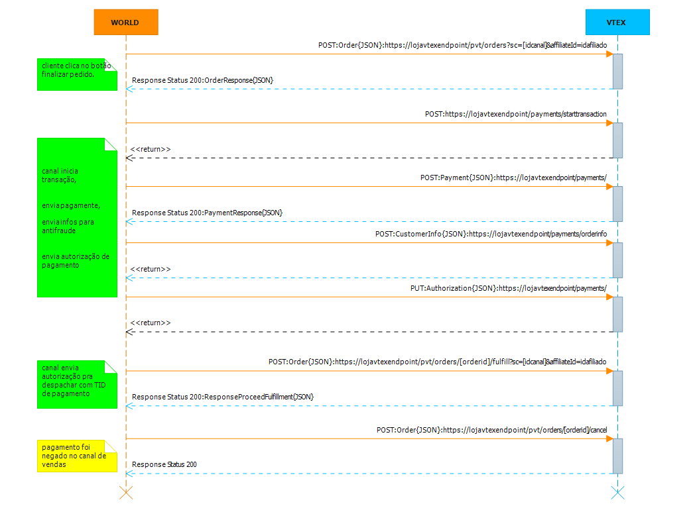

##Enviar Pedido, Enviar Pagamento e Autorizar Despacho

Este tópico tem por objetivo auxiliar um canal de vendas não VTEX a enviar um pedido, enviar um pagamento, e enviar autorização para despacho (proceder com o fulfillment do pedido).

Caso se queira uma condição comercial diferenciada para o canal de vendas não VTEX, na loja VTEX deverá ser criado um novo canal de vendas, podendo assim criar promoções diferenciadas (desconto, frete, etc) somente para o canal desejado. Caso não tenha condição comercial diferenciada, deve se usar o canal de vendas da loja principal (sc=1).

*Exemplo do fuxo de chamadas de descida de pedido, pagamento e autorização para despachar:*  

 

###Enviar Pedido
Quando o pedido é fechado em um canal de vendas não VTEX, um POST deve ser feito na loja VTEX, para que essa possa receber a ordem de pedido.  
 
####Exemplo de de Envio de Pedido - Endpoint Loja Vtex

endpoint: **https://[loja].vtexcommercestable.com.br/api/fulfillment/pvt/orders?sc=[idcanal]&affiliateId=[idafiliado]**  
verb: **POST**  
Content-Type: **application/json**  
Accept: **application/json**  
Parametro: **sc** // sc é o canal de vendas cadastrado na VTEX.  
Parametro: **affiliateId** // affiliateId é o id do afiliado cadastrado n loja VTEX

_request:_  

		  {
		    "marketplaceOrderId": "959311095",
		    "marketplaceServicesEndpoint": "https://urlmarketplace/", //leia o tópico implementando MarketplaceServicesEndpoint Actions
		    "marketplacePaymentValue": 11080,
		    "items": [
		      {
		        "id": "2002495",
		        "quantity": 1,
		        "seller": "1",
		        "commission": 0,
		        "freightCommission": 0,
		        "price": 9990,
		        "bundleItems": [], //serviços. Ex: embalagem pra presente.
		        "itemAttachment": { 
		          "name": null,
		          "content": {}
		        },
		        "attachments": [], //customização do item, Ex:camisa com o numero 10
		        "priceTags": [],
		        "measurementUnit": null, unidade de medida
		        "unitMultiplier": 0, unidade multipladora,Ex: venda por quilo
		        "isGift": false
		      }
		    ],
		    "clientProfileData": {
		      "id": "clientProfileData",
		      "email": "32172239852@gmail.com.br",
		      "firstName": "Jonas",
		      "lastName": "Alves de Oliveira",
		      "documentType": null,
		      "document": "3244239851",
		      "phone": "399271258",
		      "corporateName": null,
		      "tradeName": null,
		      "corporateDocument": null,
		      "stateInscription": null,
		      "corporatePhone": null,
		      "isCorporate": false,
		      "userProfileId": null
		    },
		    "shippingData": {
		      "id": "shippingData",
		      "address": {
		        "addressType": "Residencial",
		        "receiverName": "Jonas Alves de Oliveira",
		        "addressId": "Casa",
		        "postalCode": "13476103",
		        "city": "Americana",
		        "state": "SP",
		        "country": "BRA",
		        "street": "JOÃO DAMÁZIO GOMES",
		        "number": "311",
		        "neighborhood": "SÃO JOSÉ",
		        "complement": null,
		        "reference": "Bairro Praia Azul / Posto de Saúde 17",
		        "geoCoordinates": []
		      },
		      "logisticsInfo": [
		        {
		          "itemIndex": 0,
		          "selectedSla": "Normal",
		          "lockTTL": "8d",
		          "shippingEstimate": "7d",
		          "price": 1090,
		          "deliveryWindow": null
		        }
		      ]
		    },
		   "paymentData":{
				"merchantName":"epoca" //devolver o parametro recebido no request
			},
		    "openTextField": null,
		    "marketingData": null,
		    "paymentData":null
		  }
		

*response:*

	    
		  {
		    "marketplaceOrderId": "959311095",
		    "orderId": "123543123", //id do pedido que foi gerado na loja VTEX
		    "followUpEmail": "75c70c09dbb3498c9b3bbdee59bf0687@ct.vtex.com.br",
		    "items": [
		      {
		        "id": "2002495",
		        "quantity": 1,
		        "seller": "1",
		        "commission": 0,
		        "freightCommission": 0,
		        "price": 9990,
		        "bundleItems": [],
		        "priceTags": [],
		        "measurementUnit": "un",
		        "unitMultiplier": 1,
		        "isGift": false
		      }
		    ],
		    "clientProfileData": {
		      "id": "clientProfileData",
		      "email": "5c77abaea35f4cb6824b9326942c00e5@ct.vtex.com.br",
		      "firstName": "JONAS",
		      "lastName": "ALVES DE OLIVEIRA",
		      "documentType": "cpf",
		      "document": "32133239851",
		      "phone": "1592712979",
		      "corporateName": null,
		      "tradeName": null,
		      "corporateDocument": null,
		      "stateInscription": null,
		      "corporatePhone": null,
		      "isCorporate": false,
		      "userProfileId": null
		    },
		    "shippingData": {
		      "id": "shippingData",
		      "address": {
		        "addressType": "Residencial",
		        "receiverName": "JONAS ALVES DE OLIVEIRA",
		        "addressId": "Casa",
		        "postalCode": "13476103",
		        "city": "Americana",
		        "state": "SP",
		        "country": "BRA",
		        "street": "JOÃO DAMÁZIO GOMES",
		        "number": "121",
		        "neighborhood": "SÃO JOSÉ",
		        "complement": null,
		        "reference": "Bairro Praia Azul / Posto de Saúde 17",
		        "geoCoordinates": []
		      },
		      "logisticsInfo": [
		        {
		          "itemIndex": 0,
		          "selectedSla": "Normal",
		          "lockTTL": "8d",
		          "shippingEstimate": "5d",
		          "price": 1090,
		          "deliveryWindow": null
		        }
		      ]
		    },
		   "paymentData":{
				"merchantName":"epoca",
				"merchantPaymentReferenceId":"123543123" //inteiro id do pagamento, número que será enviado junto com o pagamento para conciliação.
			}
		  }
		

*retorno de erro:*

	{
		"error": {
		"code": "1",
		"message": "O verbo 'GET' não é compatível com a rota '/api/fulfillment/pvt/orders'",
		"exception": null
		}
	}

###Enviar Pagamento - Iniciar Transação, Enviar Dados de Pagamento, Enviar Dados de Anti Fraude e Autorização de Pagamento

Após enviar o pedido e receber o response com o paymentData.merchantPaymentReferenceId, o processo de transação de pagamento do pedido deverá ser enviado.

###Iniciar Transação

####Exemplo de Inicio de Transação - Endpoint Loja Vtex

endpoint: ****  
verb: **POST**  
Content-Type: **application/json**  
Accept: **application/json**  
Parametro: **sc** // sc é o canal de vendas cadastrado na VTEX.  
Parametro: **affiliateId** // affiliateId é o id do afiliado cadastrado n loja VTEX

###Enviar Dados de Pagamento

####Exemplo de Enviar Dados de Pagamento - Endpoint Loja Vtex

endpoint: ****  
verb: **POST**  
Content-Type: **application/json**  
Accept: **application/json**  
Parametro: **sc** // sc é o canal de vendas cadastrado na VTEX.  
Parametro: **affiliateId** // affiliateId é o id do afiliado cadastrado n loja VTEX

###Enviar Dados de Anti Fraude

####Exemplo de Enviar Dados de Anti Fraude - Endpoint Loja Vtex

endpoint: ****  
verb: **POST**  
Content-Type: **application/json**  
Accept: **application/json**  
Parametro: **sc** // sc é o canal de vendas cadastrado na VTEX.  
Parametro: **affiliateId** // affiliateId é o id do afiliado cadastrado n loja VTEX

###Autorização de Pagamento

####Exemplo de Autorização de Pagamento - Endpoint Loja Vtex

endpoint: ****  
verb: **POST**  
Content-Type: **application/json**  
Accept: **application/json**  
Parametro: **sc** // sc é o canal de vendas cadastrado na VTEX.  
Parametro: **affiliateId** // affiliateId é o id do afiliado cadastrado n loja VTEX

###Enviar Autoriação Para Despachar##
Quando o pagamento do pedido é concluído no canal de vendas não VTEX, um POST deverá ser feito na loja VTEX com o paymentTransactionId, 
para que o pedido possa prosseguir com a separação e entrega.  
 
####Exemplos de Request de Autorização - Endpoint da VTEX

endpoint: **https://[loja].vtexcommercestable.com.br/api/fulfillment/pvt/orders/[orderid]/fulfill?sc=[idcanal]&affiliateId=[idafiliado]**  
verb: **POST**  
Content-Type: **application/json**  
Accept: **application/json**  
Parametro: **sc** // sc é o canal de vendas cadastrado na VTEX.
Parametro: **affiliateId** // affiliateId é o id do afiliado cadastrado na loja VTEX

_request:_  

	{
		"marketplaceOrderId": "959311095", //id do pedido originado no canal de vendas
		"paymentTransactionId": "", //id da transação de pagamento criado.
	}

_response:_

	{
		"date": "2014-10-06 18:52:00",
		"marketplaceOrderId": "959311095",
		"orderId": "123543123",
		"receipt": "e39d05f9-0c54-4469-a626-8bb5cff169f8",
	}

##4 Implementando Marketplace Services Endpoint Actions##
O MarketplaceServicesEndpoint serve para a loja VTEX informar ao canal de vendas a nota fiscal e tracking de pedido. O envio de notas fiscais pode ser parcial, obrigando assim ao informador informar além dos valores da nota fiscal, os items ele está mandando na nota fiscal parcial.

####Exemplos de Request Para Informar Nota Fiscal - Endpoint do Canal de Vendas

endpoint: **https://marketplaceServicesEndpoint/pub/orders/[marketplaceorderId]/invoice**  
verb: **POST**  
Content-Type: **application/json**  
Accept: **application/json**  

_request:_    

	{
	    "type": "Output", //Output(venda)|Input(devolução)
	    "invoiceNumber": "NFe-00001", //numero da nota fiscal
	    "courier": "", //quando é nota fiscal, dados de tracking vem vazio
	    "trackingNumber": "", //quando é nota fiscal, dados de tracking vem vazio
	    "trackingUrl": "",//quando é nota fiscal, dados de tracking vem vazio
	    "items": [ //itens da nota
	      {
	        "id": "345117",
	        "quantity": 1,
	        "price": 9003
	      }
	    ],
	    "issuanceDate": "2013-11-21T00:00:00", //data da nota
	    "invoiceValue": 9508 //valor da nota
	  }

_response:_  

	{
	    "date": "2014-02-07T15:22:56.7612218-02:00", //data do recibo
	    "orderId": "123543123",
	    "receipt": "38e0e47da2934847b489216d208cfd91" //protocolo gerado, pode ser nulo
  	}

####Exemplos de Request Para Informar Tracking - Endpoint do Canal de Vendas

endpoint: **https://marketplaceServicesEndpoint/pub/orders/[marketplaceorderId]/invoice**  
verb: **POST**  
Content-Type: **application/json**  
Accept: **application/json**  

_request:_  

	{
	    "type": "Output",
	    "invoiceNumber": "NFe-00001",
	    "courier": "Correios", //transportadora
	    "trackingNumber": "SR000987654321", /tracking number
	    "trackingUrl": "http://traking.correios.com.br/sedex/SR000987654321", url de tracking
	    "items": [
	      {
	        "id": "345117",
	        "quantity": 1,
	        "price": 9003
	      }
	    ],
	    "issuanceDate": "2013-11-21T00:00:00",
	    "invoiceValue": 9508
	  }

_response:_  

	{
	    "date": "2014-02-07T15:22:56.7612218-02:00", //data do recibo
	    "orderId": "123543123",
	    "receipt": "38e0e47da2934847b489216d208cfd91" //protocolo gerado, pode ser nulo
  	}

###Enviar Solicitação de Cancelamento
Uma solicitação de cancelamento pode ser enviada para o Canal de Vendas não VTEX.
 
####Exemplos de Request de Cancelamento - Endpoint do Canal de Vendas

endpoint: **https://marketplaceServicesEndpoint/pvt/orders/[marketplaceorderId]/cancel**  
verb: **GET**  

**A Nota Fiscal e o Tracking podem ser enviados na mesma chamada, basta prenncher todos os dados do POST.

##Versão:Beta 1.2
Essa versão de documentação suporta a integração na versão da plataforma VTEX smartcheckout. Ela foi escrita para auxiliar um integração e a idéia e que através dela, não  restem nenhuma dúvida de como se integrar com a VTEX. Se recebeu essa documentação e ainda restaram dúvidas, por favor, detalhe as suas dúvidas abaixo no comentário, para chegarmos a um documento rico e funcional.

autor: Jonas Bolognim  
propriedade: VTEX