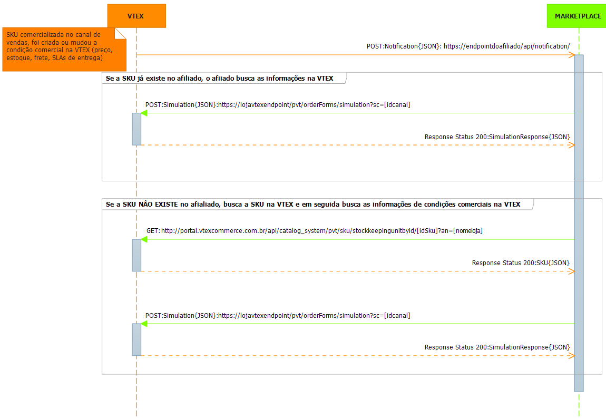

# Atualização de Condição Comercial e Inserção de SKU 

Este documento tem por objetivo auxiliar na integração e atualização de condição comercial (preço, estoque, frete, SLAs de entrega) de um *SKU entre uma loja hospedada na versão smartcheckout da VTEX e um *Canal de Vendas não VTEX.

*Exemplo de Fluxo*  

##1-Inserção e Atualização de SKU - Fluxo##

* Caso se queira uma condição comercial diferenciada para o canal de vendas, na *loja VTEX deverá ser criado um novo canal de vendas, podendo assim criar sortimento e promoções diferenciadas da loja principal.  

* Dentro da loja hospedada na VTEX, será criado um *afiliado, que é o interessado em receber o catálogo e as atualizações de condições comerciais.  

* O afiliado, deverá implementar um endpoint onde receberá informações sobre alterações de condição comercial de SKUs.  

* Na loja VTEX, cada vez que uma SKU comercializado pelo afiliado sofrer uma alteração na condição comercial, ou for reindexado, o endpoint de notificação do afiliado será chamado.  

* Quando o afiliado recebe uma notificação que um SKU mudou a condição comercial, o afiliado deve checar se já comercializa aquela SKU daquela loja que comunicou.  

  * **Caso SIM**: O afiliado consulta a condição comercial na VTEX e se atualiza.

  * **Caso NÂO**: O afiliado busca a SKu na loja, insere no seu catalogo, e depois repete o cenário do "Caso SIM".

###1.1 - Exemplos de Request de Notificação de Mudança - Endpoint do Afiliado###

endpoint: **https://endpointdoafiliado/api/notification/**  
verb: **POST**  
Content-Type: **application/json**  
Accept: **application/json**

*Exemplo do Request:*  

	{ 
		"IdSku" : "1634", //id da sku da VTEX
		"An" : "loja1", //loja vtex
		"IdAffiliate":"afiliado1" // id do afilado cadastrado na loja vtex
	}

###1.2 - Exemplos de Request de Busca de Condições Comerciais - Endpoint da Loja VTEX###

endpoint: **https://endpointlojavtex/pvt/orderForms/simulation?sc=[idcanal]&affiliateId=[idafiliado]**  
verb: **POST**  
Content-Type: **application/json**  
Accept: **application/json**  
Parametro: **sc** // sc é o canal de vendas cadastrado no marketplace  
Parametro: **affiliateId** // o id do afiliado cadastrado na loja VTEX 

*Exemplo do Request:*  

	{
        "postalCode":"22251-030",            //obrigatório se country estiver preenchido
        "country":"BRA",                     //obrigatório se postalCode estiver preenchido    
        "items": [                           //obrigatório: deve conter pelo menos um objeto item
            {
                "id":"287611",               //obrigatório, string
                "quantity":1,                //obrigatório-quantidade do item a ser simulada, int
                "seller":"1"                 //loja pricipal usar sempre 1
            },
            {
                "id":"5837",
                "quantity":5,
                "seller":"1"
            }
        ]
    }

*Exemplo do Response:*

	    {
        "items": [                                                     //pode vir um array vazio
            {
                "id": "287611",                                        //obrigatório, string
                "requestIndex": 0,                                     //obrigatório, int - representa a posição desse item no array original (request)
                "price": 7390,                                         //Os dois dígitos menos significativos são os centavos //obrigatório, int
                "listPrice": 7490,                                     //Os dois dígitos menos significativos são os centavos //obrigatório, int
                "quantity": 1,                                         //obrigatório, int
                "seller": "1",                                         //id do seller cadastrado na loja // obrigatório, string,
                "priceValidUntil": "2014-03-01T22:58:28.143"           //data, pode ser nulo
                "offerings":[                                           //Array opcional, porém não pode ser nulo: enviar array vazio ou não enviar a propriedade
                    {
                        "type":"Garantia",                               //obrigatório, string
                        "id":"5",                                       //obrigatório, string
                        "name":"Garantia de 1 ano",                       //obrigatório, string
                        "price":10000                                   //Os dois dígitos menos significativos são os centavos //obrigatório, int
                    },
                    {
                        "type":"Embalagem de Presente",
                        "id":"6",
                        "name":"Embalagem de Presente",
                        "price":250                                       
                    }
                ]
            },
            {
                "id": "5837",
                "requestIndex": 1,
                "price": 890,                                          // Os dois dígitos menos significativos são os centavos
                "listPrice": 990,                                      // Os dois dígitos menos significativos são os centavos
                "quantity": 5,
                "seller": "1",	
                "priceValidUntil": null
            }
        ],
        "logisticsInfo": [                                            //obrigatório (se vier vazio é considerado que o item não está disponível) -  todos os itens devem ter os mesmos SLAs
            {
                "itemIndex": 0,                                       //obrigatório, int - representa os dados de sla do item de resposta (response)
                "stockBalance": 99,                                   //obrigatório  quando o CEP foi passado no request, estoque, int
                "quantity": 1,                                        //obrigatório quando o CEP foi passado no request, qauntidade pasada no request, int
                "shipsTo": [ "BRA", "USA" ],                          //obrigatório, array de string com as siglas dos países de entrega
                "slas": [                                             //obrigatório quando o CEP foi passado no request. Pode ser um array vazio
                    {
                        "id": "Expressa",                             //obrigatório, id tipo entrega, string
                        "name": "Entrega Expressa",                   //obrigatório, nome do tipo entrega, string
                        "shippingEstimate": "2bd",                    // bd == "business days" //obrigatório, string
                        "price": 1000                                 // Os dois dígitos menos significativos são os centavos, obrigatório, int
                        "availableDeliveryWindows": [                 //opcional, podendo ser um array vazio
                        ]
                    },
                    {
                        "id": "Agendada",
                        "name": "Entrega Agendada",
                        "shippingEstimate": "5d",                     // d == "days, bd == "business days"
                        "price": 800,
                        "availableDeliveryWindows": [
                             {
                                "startDateUtc": "2013-02-04T08:00:00+00:00",       //date, obrigatório se for enviado delivery window
                                "endDateUtc": "2013-02-04T13:00:00+00:00",         //date, obrigatório se for enviado delivery window
                                "price": 0        //int, obrigatório se for enviado delivery window - o valor total da entrega agendada é o valor base mais o valor desse campo
                            },
                        ]
                    }
                ]
            },
            {
                "itemIndex": 1,
                "stockBalance": 1237,
                "quantity": 5,
                "shipsTo": [ "BRA" ],
                "slas": [
                    {
                        "id": "Normal",
                        "name": "Entrega Normal",
                        "shippingEstimate": "5bd",                                  // bd == "business days"
                        "price": 200
                    }
                ]
            }
        ],
        "country":"BRA",                                           //string, nulo se não enviado
        "postalCode":"22251-030"                                   //string, nulo se não enviado    
    }

###1.3 - Exemplos de Request de Busca Dados de SKU - Endpoint da Loja VTEX###

endpoint: **http://portal.vtexcommerce.com.br/api/catalog_system/pvt/sku/stockkeepingunitbyid/[idsku]?an=[nomedalojavtex]**  
verb: **GET**   
Accept: **application/json**  
Parametro: **an=nomedalojavtex** 

*Exemplo do Response:*

	    {
		    "Id": 1634, //id da sku
		    "ProductId": 1634, //id do produto pai da sku
		    "NameComplete": "Primer Lisse Minute Clarins - Base Facial Alisadora 15ml",
		    "ProductName": "Primer Lisse Minute Clarins - Base Facial Alisadora",
		    "ProductDescription": "<strong>Primer Lisse Minute</strong> deixa a pele imediatante alisada e suave ao toque. O primer da <strong>Clarins</strong> atenua as imperfeições e reduz a aparência dos poros. A pele fica linda a pronta para receber a make! Com o rosto limpo aplique o primer com os dedos ou com um pincel. Espalhe bem começando pela zona T (testa, nariz e queixo) em direção aos cantos externos do rosto.",
		    "SkuName": "15ml",
		    "IsActive": true,
		    "IsTransported": true,
		    "IsInventoried": true,
		    "IsGiftCardRecharge": false,
		    "ImageUrl": "http://epocacosmeticos.vteximg.com.br/arquivos/ids/162097-55-55/primer-lisse-minute-15ml-clarins.jpg",
		    "DetailUrl": "/primer-lisse-minute-clarins-base-facial-alisadora/p",
		    "CSCIdentification": null,
		    "BrandId": "2000050",
		    "Dimension": {
		        "cubicweight": 0.2083,
		        "height": 10,
		        "length": 10,
		        "weight": 100,
		        "width": 10
		    },
		    "IsKit": false,
		    "KitItems": [],
		    "Services": [
		        {
		            "Id": 1098,
		            "Name": "Embalagem presente",
		            "IsFile": false,
		            "IsGiftCard": false,
		            "IsRequired": false,
		            "Options": [
		                {
		                    "Id": 1098,
		                    "Name": "Embalagem presente",
		                    "Description": "Embalagem presente",
		                    "PriceName": "Embalagem presente",
		                    "ListPrice": 1,
		                    "Price": 1
		                }
		            ],
		            "Attachments": []
		        }
		    ],
		    "Categories": [],
		    "Attachments": [],
		    "Collections": [],
		    "SkuSellers": [
		        {
		            "SkuCommercialOffer": {
		                "DeliverySlaSamples": [
		                    {
		                        "Region": {
		                            "Id": "1",
		                            "Name": "RJ",
		                            "CountryCode": "BRA",
		                            "ZipCode": "22080010"
		                        },
		                        "DeliverySlaPerTypes": [
		                            {
		                                "TypeName": "Normal",
		                                "Price": 9.9,
		                                "Time": "00:00:00"
		                            }
		                        ]
		                    }
		                ],
		                "Price": 174,
		                "ListPrice": 174,
		                "AvailableQuantity": 22
		            },
		            "SellerId": "1",
		            "StockKeepingUnitId": 1634,
		            "SellerStockKeepingUnitId": "1634",
		            "IsActive": true,
		            "FreightCommissionPercentage": 0,
		            "ProductCommissionPercentage": 0
		        }
		    ],
		    "SkuPriceSheet": [],
		    "Images": [
		        {
		            "ImageUrl": "http://epocacosmeticos.vteximg.com.br/arquivos/ids/162097/primer-lisse-minute-15ml-clarins.jpg",
		            "ImageName": null,
		            "FileId": 162097
		        }
		    ],
		    "SkuSpecifications": [
		        {
		            "FieldId": 283,
		            "FieldName": "Variação",
		            "FieldValueIds": [
		                2688
		            ],
		            "FieldValues": [
		                "15ml"
		            ]
		        }
		    ],
		    "ProductSpecifications": [],
		    "ProductClustersIds": "135,149,150,151,152,153,154,155,156,157,158,159,160,161,219,310,358,366,406,407,408,451,473,480,486,525,535,546,549,552,561,569",
		    "ProductCategoryIds": "/1000004/1000012/1000040/",
		    "ProductCategories": {
		        "1000004": "Maquiagem",
		        "1000012": "Primer e Finalizador",
		        "1000040": "Fixador da Maquiagem"
		    },
		    "CommercialConditionId": 1,
		    "RewardValue": 0,
		    "AlternateIds": {
		        "Ean": "3380814700219",
		        "RefId": "005899"
		    },
		    "AlternateIdValues": [
		        "3380814700219",
		        "005899"
		    ],
		    "EstimatedDateArrival": null,
		    "MeasurementUnit": "un",
		    "UnitMultiplier": 1,
		    "InformationSource": "Indexer",
		    "ModalType": null
		}

##2 - Considerações##

####2.1 Header nas Chamadas a API REST####
Todas chamadas as API REST devem conter no Headear as seguintes Keys:  
X-VTEX-API-AppToken:**[Value]**  
X-VTEX-API-AppKey:**[Value]**  
Content-Type: **application/json**      
Accept: **application/json**   

####2.2 Ferramentas de apoio ao integrador ####
Ferramentas são de extrema importância para qualquer integrador:

**Postman - REST Client** (_chrome://extensions/_)
Nesta ferramente pode se testar, armazenar histórico, salvar coleções de requests do acesso de todas as APIs dos modulos VTEX  (OMS, Logistics, Pricing, GCS, etc).  

É de suma importancia que o integrador tenha o conhecimento de ferramentas desse tipo, ou outras parecidas, antes de inciar um processo de integração usando APIs REST VTEX.

####2.3 - Glossário####
Canal de Vendas - Marketplace onde nasce o pedido.  
SKU - Define uma variação de um produto.  
Loja VTEX - loja hospedada na versão smartcheckout da VTEX

####2.4 Versão:Beta 1.1####
Essa versão de documentação suporta a integração na versão da plataforma VTEX smartcheckout. Ela foi escrita para auxiliar um integração e a idéia e que através dela, não  restem nenhuma dúvida de como se integrar com a VTEX. Se recebeu essa documentação e ainda restaram dúvidas, por favor, detalhe as suas dúvidas abaixo no comentário, para chegarmos a um documento rico e funcional.

Autor: *Jonas Bolognim*  
Propriedade:*VTEX*