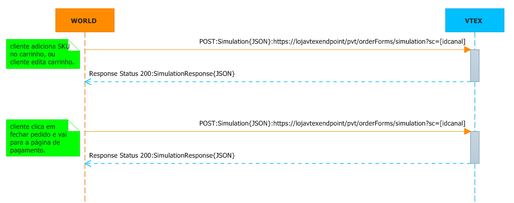

# Simulação de Carrinho #

Este documento tem por objetivo auxiliar o na simulação de carrinho entre um canal de vendas não VTEX com uma loja  VTEX. Simular um pedido no carrinho e na página de pagamento.

##1 - No Carrinho e no Pagamento##
Quando um produto é inserido no carrinho no canal de vendas não VTEX, ou faz se alguma edição no carrinho, uma consulta de simulaçao de carrinho é feita na loja VTEX para checar a validade das condiçoes comerciais(preço, estoque, frete e SLAs de entrega). Quando o cliente vai para o pagamento também pode validar o carrinho.

*Exemplo do fuxo de chamadas no carrinho e pagamento:*  

  

###1.1 - Exemplos de Request de Simulação de Carrinho - Endpoint loja VTEX###

endpoint: **https://[loja].vtexcommercestable.com.br/api/fulfillment/pvt/orderForms/simulation?sc=[idcanal]&affiliateId=[iddoafilaido]**  
verb: **POST**  
Content-Type: **application/json**  
Accept: **application/json**  
Parametro: **sc=5** // sc é o canal de vendas  
Parametro: **affiliateId=MGZ** // affiliateId é o id do afialiado cadastrado na loja VTEX

*Exemplo do Request:*  

	{
        "postalCode":"22251-030",            //obrigatório se country estiver preenchido, string
        "country":"BRA",                     //obrigatório se postalCode estiver preenchido, string      
        "items": [                           //obrigatório: deve conter pelo menos um objeto item
            {
                "id":"287611",               //obrigatório, string
                "quantity":1,                //obrigatório-quantidade do item a ser simulada, int
                "seller":"1"           //enviar "1" // obrigatório, string
            },
            {
                "id":"5837",
                "quantity":5,
                "seller":"1"
            }
        ]
    }

*Exemplo do Response:*

	    {
        "items": [                                                     //pode vir um array vazio
            {
                "id": "287611",                                        //obrigatório, string
                "requestIndex": 0,                                     //obrigatório, int - representa a posição desse item no array original (request)
                "price": 7390,                                         // Os dois dígitos menos significativos são os centavos //obrigatório, int
                "listPrice": 7490,                                     // Os dois dígitos menos significativos são os centavos //obrigatório, int
                "quantity": 1,                                         //obrigatório, int
                "seller": "1",                                         // Id do seller cadastrado na loja // obrigatório, string,
                "priceValidUntil": "2014-03-01T22:58:28.143"           //data, pode ser nulo
                "offerings":[                                           //Array opcional, porém não pode ser nulo: enviar array vazio ou não enviar a propriedade
                    {
                        "type":"Garantia",                               //obrigatório, string
                        "id":"5",                                       //obrigatório, string
                        "name":"Garantia de 1 ano",                       //obrigatório, string
                        "price":10000                                   //Os dois dígitos menos significativos são os centavos //obrigatório, int
                    },
                    {
                        "type":"Embalagem de Presente",
                        "id":"6",
                        "name":"Embalagem de Presente",
                        "price":250                                       
                    }
                ]
            },
            {
                "id": "5837",
                "requestIndex": 1,
                "price": 890,                                          // Os dois dígitos menos significativos são os centavos
                "listPrice": 990,                                      // Os dois dígitos menos significativos são os centavos
                "quantity": 5,
                "seller": "1",	
                "priceValidUntil": null
            }
        ],
        "logisticsInfo": [                                            //obrigatório (se vier vazio é considerado que o item não está disponível) -  todos os itens devem ter os mesmos SLAs
            {
                "itemIndex": 0,                                       //obrigatório, int - representa os dados de sla do item de resposta (response)
                "stockBalance": 99,                                   //obrigatório  quando o CEP foi passado no request, estoque, int
                "quantity": 1,                                        //obrigatório quando o CEP foi passado no request, qauntidade pasada no request, int
                "shipsTo": [ "BRA", "USA" ],                          //obrigatório, array de string com as siglas dos países de entrega
                "slas": [                                             //obrigatório quando o CEP foi passado no request. Pode ser um array vazio
                    {
                        "id": "Expressa",                             //obrigatório, id tipo entrega, string
                        "name": "Entrega Expressa",                   //obrigatório, nome do tipo entrega, string
                        "shippingEstimate": "2bd",                    // bd == "business days" //obrigatório, string
                        "price": 1000                                 // Os dois dígitos menos significativos são os centavos, obrigatório, int
                        "availableDeliveryWindows": [                 //opcional, podendo ser um array vazio
                        ]
                    },
                    {
                        "id": "Agendada",
                        "name": "Entrega Agendada",
                        "shippingEstimate": "5d",                     // d == "days, bd == "business days"
                        "price": 800,
                        "availableDeliveryWindows": [
                             {
                                "startDateUtc": "2013-02-04T08:00:00+00:00",       //date, obrigatório se for enviado delivery window
                                "endDateUtc": "2013-02-04T13:00:00+00:00",         //date, obrigatório se for enviado delivery window
                                "price": 0        //int, obrigatório se for enviado delivery window - o valor total da entrega agendada é o valor base mais o valor desse campo
                            },
                        ]
                    }
                ]
            },
            {
                "itemIndex": 1,
                "stockBalance": 1237,
                "quantity": 5,
                "shipsTo": [ "BRA" ],
                "slas": [
                    {
                        "id": "Normal",
                        "name": "Entrega Normal",
                        "shippingEstimate": "5bd",                                  // bd == "business days"
                        "price": 200
                    }
                ]
            }
        ],
        "country":"BRA",                                           //string, nulo se não enviado
        "postalCode":"22251-030"                                   //string, nulo se não enviado    
    }

##2 Versão:Beta 1.1##
Essa versão de documentação suporta a integração na versão da plataforma VTEX smartcheckout. Ela foi escrita para auxiliar um integração e a idéia e que através dela, não  restem nenhuma dúvida de como se integrar com a VTEX. Se recebeu essa documentação e ainda restaram dúvidas, por favor, detalhe as suas dúvidas abaixo no comentário, para chegarmos a um documento rico e funcional.

 
autor: _Jonas Bolognim_  
propriedade: _VTEX_